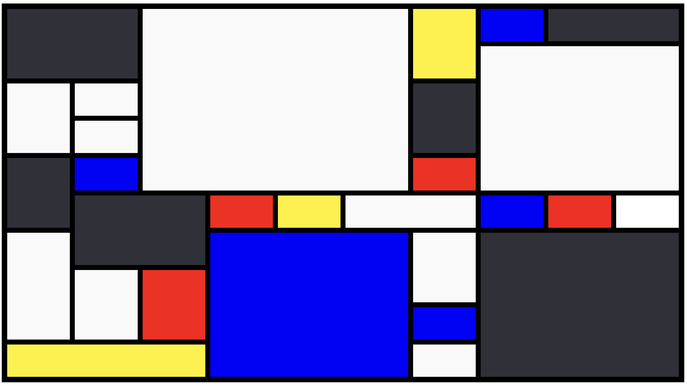

# non-objective composition

(2/6/23)

Inspired by Piet Mondrian, this sketch encourages you, dear reader, to create random compositions by hovering your mouse over the empty boxes and fill them with color. 

An example: 

